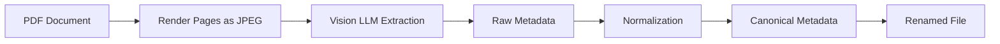

<div align="center">
  

  [](https://www.python.org/)
  [](LICENSE)
  [](https://openrouter.ai/)
  [](https://pymupdf.readthedocs.io/)

  **📄 AI-powered PDF document classification and organization using vision LLMs**

  [Quick Start](#-quick-start) · [Features](#-features) · [Documentation](CLAUDE.md)
</div>

---

## Overview

papertrail uses vision LLMs to "read" your PDFs and automatically extract metadata like dates, document types, and issuing parties. It renders PDF pages as images, sends them to AI models for analysis, and organizes your files with consistent naming.

**Before:** `scan_2024_001.pdf`, `document(3).pdf`, `IMG_4521.pdf`

**After:** `2025-01-02 - invoice - anthropic - claude-api - 120 eur - a1b2c3d4.pdf`

Drop a folder of invoices, receipts, contracts, and statements—papertrail figures out what's what and puts everything in order.

## ✨ Features

- **Vision-based extraction** — Reads documents exactly as a human would, no brittle text parsing
- **Two-phase pipeline** — Raw extraction + normalization ensures consistent, canonical values
- **Smart duplicate detection** — Content-based hashing detects duplicates even when PDF metadata differs
- **Gmail integration** — Automatically download and process PDF attachments from your email
- **Dynamic classification** — Document types and issuing parties learned from your existing files
- **Excel export** — Generate spreadsheets for accounting and record-keeping
- **Batch processing** — Process hundreds of documents with progress tracking

## 🚀 Quick Start

```bash
# Install with uv (recommended)
git clone https://github.com/tsilva/papertrail.git
cd papertrail
uv pip install -e .

# Configure environment
cp .env.example .env
# Edit .env with your OpenRouter API key and folder paths

# Process PDFs
python main.py extract_new /path/to/processed --raw_path /path/to/raw
```

### Output Example

```
Raw file:  scan_20250115_001.pdf
Becomes:   2025-01-15 - invoice - anthropic - claude-api - 120 eur - a1b2c3d4.pdf
```

## 📦 Installation

### Prerequisites

- Python 3.10+
- [OpenRouter API key](https://openrouter.ai/) (supports GPT-4, Gemini, and other vision models)
- [uv](https://github.com/astral-sh/uv) package manager (recommended) or pip

### Standard Installation

```bash
git clone https://github.com/tsilva/papertrail.git
cd papertrail
uv pip install -e .
```

### Configuration

Create a `.env` file in the repository root:

```env
OPENROUTER_MODEL_ID=google/gemini-2.5-flash
OPENROUTER_API_KEY=sk-or-v1-...
RAW_FILES_DIR=/path/to/raw/pdfs
PROCESSED_FILES_DIR=/path/to/processed
EXPORT_FILES_DIR=/path/to/export
```

**Cost estimate**: GPT-4 Vision costs ~$0.02-0.05 per document. Gemini Flash is 10-20x cheaper.

### Profile-Based Configuration

Profiles simplify multi-environment management:

```bash
cp profiles/default.yaml.example profiles/default.yaml
python main.py --profile default extract_new /path/to/processed
```

See [profiles/README.md](profiles/README.md) for detailed documentation.

<details>
<summary><strong>Gmail Integration Setup</strong></summary>

1. Create a project in [Google Cloud Console](https://console.cloud.google.com/)
2. Enable Gmail API and create OAuth 2.0 credentials (Desktop application)
3. Download credentials as `config/gmail_credentials.json`
4. Copy `config/gmail_settings.json.example` to `config/gmail_settings.json`
5. First run opens browser for OAuth authorization

</details>

## 📖 Usage

### Basic Workflow

```bash
# 1. Process new PDFs from raw folder
python main.py extract_new /path/to/processed --raw_path /path/to/raw

# 2. Rename files based on extracted metadata
python main.py rename_files /path/to/processed

# 3. Export to Excel for accounting
python main.py export_excel /path/to/processed --excel_output_path invoices.xlsx
```

### Available Commands

| Command | Description |
|---------|-------------|
| `extract_new` | Process new PDFs from raw folder |
| `rename_files` | Rename files based on metadata |
| `validate_metadata` | Check metadata consistency |
| `export_excel` | Export to Excel spreadsheet |
| `copy_matching` | Copy files matching regex pattern |
| `export_all_dates` | Export files by date ranges |
| `pipeline` | Full end-to-end workflow |
| `gmail_download` | Download Gmail attachments |
| `bootstrap_mappings` | Populate mappings from existing metadata |
| `review_mappings` | Interactive review of auto-added mappings |
| `add_canonical` | Add a new canonical value |

### Full Pipeline

```bash
# Run complete pipeline: download from Gmail → extract → rename → export
python main.py pipeline /path/to/processed --export_date 2025-01
```

## 🏗️ How It Works

### Two-Phase Extraction Pipeline



**Phase 1 — Raw Extraction**: Renders PDF pages as images, sends to vision LLM, extracts metadata exactly as it appears on the document.

**Phase 2 — Normalization**: Maps raw values to canonical forms using learned mappings.

### Two-Tier Normalization

papertrail learns from your documents. When it sees "Anthropic, PBC" the first time, it normalizes to `anthropic` and remembers. Next time—instant lookup, no LLM call.

```
Raw: "Anthropic, PBC" → Check mappings.yaml → Found! → Return "anthropic"
Raw: "New Vendor Inc" → Not found → LLM → "new-vendor" → Save mapping
```

### Two-Tier Hashing

| Hash Type | Purpose | Speed |
|-----------|---------|-------|
| **Fast hash** | Quick duplicate filtering | Instant |
| **Content hash** | True duplicates (different metadata, same content) | ~1-2 sec/doc |

## 🛠️ Development

```bash
# Debug a classification
python scripts/debug_classification.py /path/to/document.pdf

# Check file hashes
python scripts/check_hash.py /path/to/document.pdf
```

## 🔧 Troubleshooting

| Issue | Solution |
|-------|----------|
| Classification returns `$UNKNOWN$` | Run `python scripts/debug_classification.py` to inspect LLM output |
| Duplicates not detected | Run `python scripts/update_hashes.py /processed` to update content hashes |
| High API costs | Switch to `google/gemini-2.5-flash` for 10-20x cost reduction |

## 📄 License

MIT License — see [LICENSE](LICENSE) for details.

---

<div align="center">
  <sub>Built by <a href="https://github.com/tsilva">Tiago Silva</a> · Powered by <a href="https://openrouter.ai/">OpenRouter</a> and Vision LLMs</sub>
</div>
