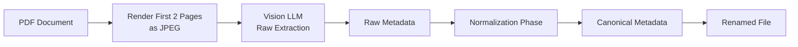

<div align="center">
  

  [](https://www.python.org/)
  [](LICENSE)
  [](https://openrouter.ai/)
  [](https://pymupdf.readthedocs.io/)

  **Stop manually organizing PDFs. Let AI read, classify, and rename your documents automatically.**

  [Quick Start](#-quick-start) · [Features](#-features) · [Documentation](CLAUDE.md)
</div>

---

## Overview

Documentor automates the tedious task of organizing PDF documents by using vision-capable LLMs to extract and classify metadata directly from document images. It renders PDF pages as images, sends them to AI models for analysis, and automatically renames and organizes files based on extracted information.

**Before:** `scan_2024_001.pdf`, `document(3).pdf`, `IMG_4521.pdf`
**After:** `2025-01-02 - invoice - anthropic - claude-api - 120 eur - a1b2c3d4.pdf`

Perfect for organizing invoices, receipts, bank statements, and any document collection that needs consistent naming and metadata extraction.

## Features

- **Vision-based extraction** - Reads documents exactly as a human would, no brittle text parsing required
- **Two-phase pipeline** - Raw extraction + normalization ensures consistent, canonical values
- **Smart duplicate detection** - Content-based hashing detects duplicates even when PDF metadata differs
- **Gmail integration** - Automatically download and process PDF attachments from your email
- **Dynamic classification** - Document types and issuing parties are learned from your existing files
- **Excel export** - Generate spreadsheets for accounting and record-keeping
- **Batch processing** - Process hundreds of documents with progress tracking
- **Multiple folder support** - Monitor and process from multiple raw document directories

## Quick Start

```bash
# Install with uv (recommended)
git clone https://github.com/tsilva/documentor.git
cd documentor
uv pip install -e .

# Configure environment
cp .env.example .env
# Edit .env with your OpenRouter API key and folder paths

# Process PDFs
documentor extract_new /path/to/processed --raw_path /path/to/raw
```

**Your first document will be classified and renamed in under 10 seconds.**

## Installation

### Prerequisites

- Python 3.10 or higher
- [OpenRouter API key](https://openrouter.ai/) (supports GPT-4, Gemini, and other vision models)
- [uv](https://github.com/astral-sh/uv) package manager (recommended) or pip

### Standard Installation

```bash
# Clone repository
git clone https://github.com/tsilva/documentor.git
cd documentor

# Install with uv (recommended)
uv pip install -e .

# Or with pip
pip install -e .
```

### Configuration

Create a `.env` file in the repository root:

```env
# OpenRouter configuration
OPENROUTER_MODEL_ID=openai/gpt-4.1              # or google/gemini-2.5-flash
OPENROUTER_API_KEY=sk-or-v1-...                 # Your API key
OPENROUTER_BASE_URL=https://openrouter.ai/api/v1

# Document directories (multiple paths separated by ';')
RAW_FILES_DIR=/path/to/raw/pdfs;/optional/second/path
PROCESSED_FILES_DIR=/path/to/processed
EXPORT_FILES_DIR=/path/to/export
```

**Cost estimate**: Using GPT-4 Vision, processing a 2-page invoice costs approximately $0.02-0.05 per document.

<details>
<summary><strong>Gmail Integration Setup (Optional)</strong></summary>

To automatically download PDF attachments from Gmail:

1. **Get Google Cloud credentials**:
   - Create a project in [Google Cloud Console](https://console.cloud.google.com/)
   - Enable Gmail API
   - Create OAuth 2.0 credentials (Desktop application)
   - Download credentials as `config/gmail_credentials.json`

2. **Configure Gmail settings**:
   ```bash
   cp config/gmail_settings.json.example config/gmail_settings.json
   ```

3. **Edit settings** for MIME types and label filters:
   ```json
   {
     "mime_types": ["application/pdf"],
     "label_ids": ["INBOX"],
     "max_results": 100
   }
   ```

4. **First run** will open browser for OAuth authorization and save token to `config/gmail_token.json`

</details>

## Usage

### Basic Workflow

```bash
# 1. Process new PDFs from raw folder
documentor extract_new /path/to/processed --raw_path /path/to/raw

# 2. Rename files based on extracted metadata
documentor rename_files /path/to/processed

# 3. Export to Excel for accounting
documentor export_excel /path/to/processed --excel_output_path invoices_2025.xlsx
```

### Available Commands

| Command | Description | Example |
|---------|-------------|---------|
| `extract_new` | Process new PDFs from raw folder | `documentor extract_new /processed --raw_path /raw` |
| `rename_files` | Rename files based on metadata | `documentor rename_files /processed` |
| `validate_metadata` | Check metadata consistency | `documentor validate_metadata /processed` |
| `export_excel` | Export to Excel spreadsheet | `documentor export_excel /processed --excel_output_path out.xlsx` |
| `copy_matching` | Copy files matching regex pattern | `documentor copy_matching /processed --regex_pattern "anthropic" --copy_dest_folder /dest` |
| `export_all_dates` | Export files by date ranges | `documentor export_all_dates /processed --export_base_dir /export` |
| `check_files_exist` | Validate against schema | `documentor check_files_exist /processed --check_schema_path schema.json` |
| `pipeline` | Full end-to-end workflow | `documentor pipeline /processed --export_date 2025-01` |
| `gmail_download` | Download Gmail attachments | `documentor gmail_download /processed` |

### Debug Tools

```bash
# Debug classification for a specific PDF (shows full LLM response with images)
python scripts/debug_classification.py /path/to/document.pdf

# Check both fast hash and content hash for a file
check-hash /path/to/document.pdf
```

### Example: Full Pipeline

```bash
# Run complete pipeline: download from Gmail → extract → rename → export
documentor pipeline /path/to/processed --export_date 2025-01
```

This will:
1. Download new PDF attachments from Gmail
2. Process any new documents in raw folders
3. Rename files according to metadata
4. Validate metadata consistency
5. Export to Excel for the specified month

## How It Works

### Two-Phase Extraction Pipeline



**Phase 1 - Raw Extraction**: Renders the first 2 pages as JPEG images, sends them to a vision-capable LLM (GPT-4 Vision, Gemini, etc.), and extracts metadata exactly as it appears on the document.

**Phase 2 - Normalization**: Maps raw extracted values to canonical enums using fuzzy matching and predefined mappings (e.g., "Anthropic, PBC" → "Anthropic", "€" → "EUR").

### Two-Tier Hashing System

Documentor uses a sophisticated dual-hash approach to detect duplicates:

| Hash Type | Algorithm | Purpose | Performance |
|-----------|-----------|---------|-------------|
| **Fast hash** | SHA256 of raw bytes (8 chars) | Quick duplicate filtering during ingestion | Instant |
| **Content hash** | SHA256 of rendered pixels at 150 DPI | Detect true duplicates even if PDF metadata differs | ~1-2 sec/doc |

**Why both?** The fast hash quickly filters obvious duplicates. The content hash detects duplicates that have been re-saved, edited, or have different metadata but identical visual content.

### Dynamic Classification

Document types and issuing parties are not hardcoded. They are dynamically loaded from existing metadata JSON files in your processed directory. This means:

- Your first few documents establish the classification patterns
- New document types are automatically added as you process documents
- The system adapts to your specific use case (invoices, receipts, statements, contracts, etc.)
- Always includes `$UNKNOWN$` fallback for unrecognized values

### File Naming Convention

Generated filenames follow a consistent, sortable pattern:

```
YYYY-MM-DD - document-type - issuing-party - [service] - [amount currency] - hash.pdf
```

**Examples**:
- `2025-01-02 - invoice - anthropic - claude-api - 120 eur - a1b2c3d4.pdf`
- `2024-12-15 - receipt - aws - ec2 - 450 usd - e5f6g7h8.pdf`
- `2025-01-10 - bank-statement - chase - checking - 0 usd - i9j0k1l2.pdf`

All components are lowercase, sanitized, and safe for all filesystems.

## Data Models

Documentor uses Pydantic models for type-safe metadata handling:

```python
class DocumentMetadataRaw:
    """Phase 1: Exact text from document"""
    issue_date: str
    document_type: str
    issuing_party: str
    service_name: Optional[str]
    total_amount: Optional[float]
    total_amount_currency: Optional[str]
    confidence: float
    reasoning: str

class DocumentMetadata:
    """Phase 2: Normalized with hashes and timestamps"""
    issue_date: str
    document_type: DocumentType        # Enum
    issuing_party: IssuingParty        # Enum
    service_name: Optional[str]
    total_amount: Optional[float]
    total_amount_currency: Optional[str]
    confidence: float
    reasoning: str
    content_hash: str                  # 8-char content hash
    file_hash: str                     # 8-char fast hash
    create_date: datetime
    update_date: datetime
    document_type_raw: str             # Original extracted value
    issuing_party_raw: str             # Original extracted value
```

Metadata is stored as JSON sidecar files alongside each PDF (e.g., `document.pdf` → `document.json`).

## Project Structure

```
documentor/
├── main.py                          # Core application (~1666 lines)
│   ├── Classification pipeline      # Lines 567-650
│   ├── Normalization logic          # Lines 487-565
│   ├── Hashing functions            # Lines 348-385
│   └── CLI task handlers            # Lines 1167-1578
├── documentor/
│   ├── config.py                    # Environment and OpenAI client
│   ├── gmail.py                     # Gmail API integration
│   ├── hashing.py                   # Two-tier hashing system
│   ├── llm.py                       # LLM prompts and tools
│   ├── logging_utils.py             # Failure logging
│   ├── metadata.py                  # Metadata operations
│   ├── models.py                    # Pydantic models
│   └── pdf.py                       # PDF rendering utilities
├── scripts/
│   ├── debug_classification.py      # Debug LLM classification
│   ├── check_hash.py                # Verify file hashes (CLI: check-hash)
│   ├── update_hashes.py             # Batch update hashes
│   └── migrate_duplicates.py        # Handle duplicate files
├── config/                          # Configuration files (gitignored)
│   ├── passwords.txt.example        # ZIP extraction passwords
│   ├── gmail_credentials.json       # OAuth2 credentials
│   ├── gmail_settings.json.example  # Gmail download settings
│   └── document_types.json.example  # Fallback document types
├── pyproject.toml                   # Project metadata and dependencies
├── CLAUDE.md                        # AI assistant context documentation
└── README.md                        # This file
```

## Environment Variables

| Variable | Required | Description | Example |
|----------|----------|-------------|---------|
| `OPENROUTER_MODEL_ID` | Yes | Vision model to use | `openai/gpt-4.1` or `google/gemini-2.5-flash` |
| `OPENROUTER_API_KEY` | Yes | Your OpenRouter API key | `sk-or-v1-...` |
| `OPENROUTER_BASE_URL` | No | API endpoint | `https://openrouter.ai/api/v1` (default) |
| `RAW_FILES_DIR` | Yes | Source PDF directories (`;` separated) | `/path/to/raw;/another/path` |
| `PROCESSED_FILES_DIR` | Yes | Destination for processed files | `/path/to/processed` |
| `EXPORT_FILES_DIR` | Yes | Export directory for date-based exports | `/path/to/export` |

## Supported Models

Documentor works with any vision-capable model available on OpenRouter:

| Model | Provider | Speed | Cost (per doc) | Recommended For |
|-------|----------|-------|----------------|-----------------|
| `openai/gpt-4.1` | OpenAI | Medium | $0.02-0.05 | Highest accuracy |
| `google/gemini-2.5-flash` | Google | Fast | $0.001-0.005 | Cost-effective processing |
| `anthropic/claude-3-5-sonnet` | Anthropic | Medium | $0.03-0.06 | Complex documents |
| `openai/gpt-4o-mini` | OpenAI | Fast | $0.005-0.01 | Budget-friendly |

Performance tested on 2-page invoices. Actual costs vary based on document complexity.

## Common Workflows

### Workflow 1: Process Monthly Invoices

```bash
# 1. Download from Gmail
documentor gmail_download /path/to/processed

# 2. Process new documents
documentor extract_new /path/to/processed --raw_path /path/to/raw

# 3. Export to Excel for accounting
documentor export_excel /path/to/processed --excel_output_path invoices_january_2025.xlsx
```

### Workflow 2: Organize Historical Documents

```bash
# Process existing PDFs
documentor extract_new /path/to/processed --raw_path /path/to/historical

# Validate metadata consistency
documentor validate_metadata /path/to/processed

# Export by date ranges
documentor export_all_dates /path/to/processed --export_base_dir /export
```

### Workflow 3: Filter and Copy Specific Documents

```bash
# Copy all documents from a specific company
documentor copy_matching /path/to/processed \
  --regex_pattern "anthropic" \
  --copy_dest_folder /path/to/anthropic_docs
```

## Advanced Features

### Password-Protected ZIPs

Documentor can automatically extract PDFs from password-protected ZIP files. Add passwords to `config/passwords.txt`:

```
password1
password2
password3
```

The system will try each password when encountering encrypted archives.

### Custom Document Types

Document types are dynamically discovered from your existing metadata. To seed initial types, create `config/document_types.json`:

```json
[
  "invoice",
  "receipt",
  "bank-statement",
  "contract",
  "tax-document",
  "$UNKNOWN$"
]
```

### Validation Schema

Create custom validation rules in `config/file_check_validations.json`:

```json
{
  "2025-01": {
    "invoice - anthropic": {
      "count": 1,
      "amount": 120.00,
      "currency": "EUR"
    }
  }
}
```

Run validation: `documentor check_files_exist /processed --check_schema_path config/file_check_validations.json`

## Troubleshooting

### Common Issues

**Problem**: Classification returns `$UNKNOWN$` for document type
**Solution**: Ensure the first 2 pages of the PDF contain clear document type information. Use `python scripts/debug_classification.py` to see what the LLM is seeing.

**Problem**: Duplicate files not detected
**Solution**: Run content hash update: `python scripts/update_hashes.py /processed`. Content hashing is slower but more reliable.

**Problem**: Gmail authentication fails
**Solution**: Delete `config/gmail_token.json` and re-authenticate. Ensure Gmail API is enabled in Google Cloud Console.

**Problem**: High API costs
**Solution**: Switch to `google/gemini-2.5-flash` for 10-20x cost reduction with similar accuracy.

### Debug Mode

Enable verbose logging by examining the LLM's raw response:

```bash
python scripts/debug_classification.py /path/to/problem_document.pdf
```

This shows:
- The exact images sent to the LLM
- The full API response including reasoning
- Extracted metadata before normalization
- Any validation errors

## Performance

Benchmarked on M1 MacBook Pro with 100 2-page invoices:

| Operation | Time | Throughput |
|-----------|------|------------|
| Fast hash calculation | 0.05s/doc | 1200 docs/min |
| Content hash calculation | 1.2s/doc | 50 docs/min |
| LLM classification (GPT-4) | 3-5s/doc | 12-20 docs/min |
| LLM classification (Gemini Flash) | 1-2s/doc | 30-60 docs/min |
| Excel export (1000 docs) | 2.1s | N/A |

Network latency and API rate limits are the primary bottlenecks. Use Gemini Flash for maximum throughput.

## Dependencies

| Category | Packages | Purpose |
|----------|----------|---------|
| **Core** | `openai`, `PyMuPDF`, `pydantic` | LLM API, PDF rendering, data validation |
| **Data** | `pandas`, `openpyxl` | Excel export, data manipulation |
| **Utils** | `pillow`, `tqdm`, `python-dotenv` | Image processing, progress bars, config |
| **Gmail** | `google-api-python-client`, `google-auth-*` | Email integration |

Full dependency list in `pyproject.toml`.

## Contributing

Contributions are welcome. Please:

1. Open an issue to discuss proposed changes before submitting a pull request
2. Follow existing code style (Black formatter, type hints)
3. Add tests for new features (when test suite is added)
4. Update CLAUDE.md with any significant changes

## Roadmap

- [ ] Add test suite with pytest
- [ ] Support for scanned documents (OCR integration)
- [ ] Web interface for manual review and correction
- [ ] Bulk metadata editing
- [ ] Integration with accounting software (QuickBooks, Xero)
- [ ] Support for non-PDF formats (images, Word docs)

## License

This project is licensed under the MIT License. See the [LICENSE](LICENSE) file for details.

---

<div align="center">
  <strong>Built by <a href="https://github.com/tsilva">Tiago Silva</a></strong>
  <br><br>
  If this project helps you organize your documents, consider giving it a ⭐
  <br><br>
  <sub>Powered by <a href="https://openrouter.ai/">OpenRouter</a> • <a href="https://pymupdf.readthedocs.io/">PyMuPDF</a> • Vision LLMs</sub>
</div>
