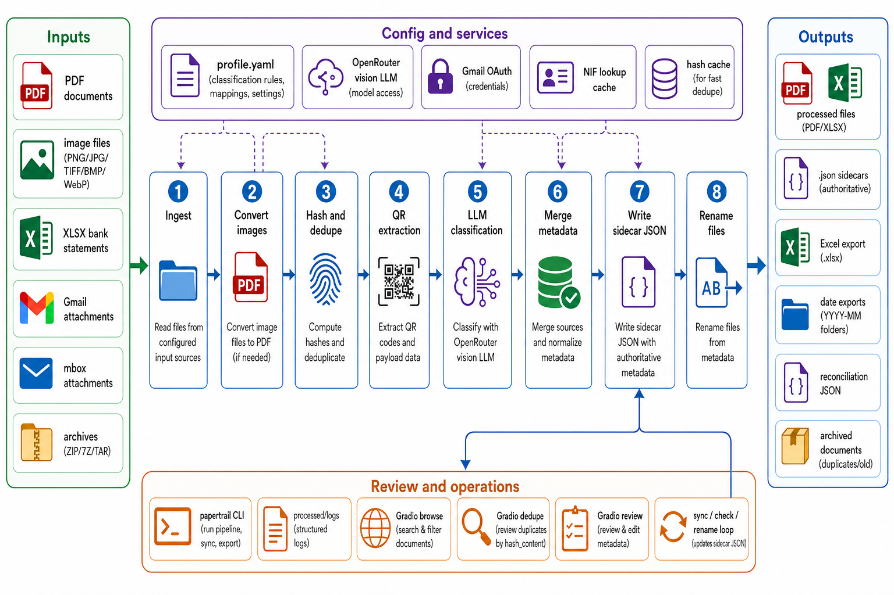

<div align="center">
  

  **🧾 Sort documents into sidecar-backed order 🧾**
</div>

papertrail is a Python CLI for classifying, deduplicating, renaming, exporting, and reconciling personal or business documents. It handles PDFs with a vision LLM through OpenRouter, image files converted to PDF, and supported bank-statement XLSX exports with deterministic parsers.

The processed folder contains the document files and authoritative `.json` sidecars. Filenames are derived from sidecar metadata, while `sync`, `check`, and `rename` repair the collection when metadata changes.

## Install

papertrail requires Python 3.12+, `uv`, and an OpenRouter API key for LLM classification.

```bash
git clone https://github.com/tsilva/papertrail.git
cd papertrail
uv venv --python 3.12
source .venv/bin/activate
uv pip install -e '.[dev]'
mkdir -p ~/.config/papertrail/profiles/personal
cp profile.yaml.example ~/.config/papertrail/profiles/personal/profile.yaml
```

Edit `~/.config/papertrail/profiles/personal/profile.yaml` with your raw, processed, export, and OpenRouter settings, then run:

```bash
papertrail --profile personal pipeline
```

## Commands

```bash
papertrail --profile personal pipeline                         # ingest, classify, export, reconcile
papertrail --profile personal extract                          # process new raw PDFs, images, and XLSX files
papertrail --profile personal sync --all-unknown               # reprocess unknown metadata
papertrail --profile personal check --verify-hashes            # audit metadata and hashes
papertrail --profile personal rename                           # rename files from sidecar JSON
papertrail --profile personal reconcile                        # reconcile exported documents to bank rows
papertrail --profile personal review                           # open reconciliation review UI
papertrail --profile personal gmail --months 2                 # download Gmail attachments
papertrail --profile personal export excel --output /tmp/docs.xlsx
papertrail --profile personal export dates --base-dir /tmp/export
papertrail --profile personal export copy --pattern 2026-01 --dest /tmp/january
.venv/bin/python -m pytest -q                                  # run tests
```

## Notes

- Profiles live under `~/.config/papertrail/profiles/<name>/profile.yaml`.
- Caches live under `~/.config/papertrail/cache/`; Gmail credentials live under `~/.config/papertrail/credentials/`.
- Logs are written to `{processed}/logs/` for extraction, sync, pipeline, and classification failures.
- QR extraction requires the `pyzbar` package and the system `zbar` library.
- Duplicate detection uses `hash_content`; filenames use `hash_file`, so visually identical PDFs can still keep distinct byte-based names.
- `$UNKNOWN$` is the fallback sentinel for unrecognized metadata.
- Sidecar JSON is the source of truth. If a filename and sidecar disagree, `rename` fixes the filename.
- Local Gradio tools can be run directly with `python tools/browse.py`, `python tools/dedupe.py`, and `python tools/review.py`.

## Architecture



## License

[MIT](LICENSE)
