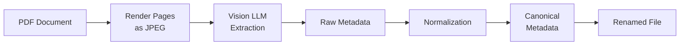

<div align="center">
  

  [](https://www.python.org/)
  [](https://opensource.org/licenses/MIT)
  [](https://openrouter.ai/)
  [](https://pymupdf.readthedocs.io/)

  **Stop manually organizing PDFs. Let AI read, classify, and rename your documents automatically.**

  [Quick Start](#-quick-start) · [Features](#-features) · [CLI Reference](#-cli-reference) · [How It Works](#-how-it-works)
</div>

---

## Table of Contents

- [Overview](#-overview)
- [Features](#-features)
- [Quick Start](#-quick-start)
- [Installation](#-installation)
- [Usage](#-usage)
- [How It Works](#-how-it-works)
- [CLI Reference](#-cli-reference)
- [Project Structure](#-project-structure)
- [Contributing](#-contributing)
- [License](#-license)

## 📖 Overview

Documentor automates the tedious task of organizing PDF documents by using vision-capable LLMs to extract and classify metadata directly from document images. It renders PDF pages as images, sends them to AI models for analysis, and automatically renames and organizes files based on extracted information like issue dates, document types, issuing parties, and amounts.

**Before:** `scan_2024_001.pdf`, `document(3).pdf`, `IMG_4521.pdf`

**After:** `2025-01-02 - invoice - anthropic - claude-api - 120 eur - a1b2c3d4.pdf`

## ✨ Features

| Feature | Benefit |
|---------|---------|
| **Vision-based extraction** | Reads documents exactly as a human would - no brittle text parsing |
| **Two-phase pipeline** | Raw extraction + normalization ensures consistent, canonical values |
| **Smart duplicate detection** | Content-based hashing detects duplicates even when PDF metadata differs |
| **Gmail integration** | Automatically download PDF attachments from your email |
| **Dynamic classification** | Document types and issuing parties are learned from your existing files |
| **Excel export** | Generate spreadsheets for accounting and record-keeping |

## 🚀 Quick Start

```bash
# Install
git clone https://github.com/tsilva/documentor.git
cd documentor
uv pip install -e .

# Configure
cp .env.example .env
# Edit .env with your OpenRouter API key and paths

# Process PDFs
documentor extract_new /path/to/processed --raw_path /path/to/raw
```

## 📦 Installation

### Prerequisites

- Python 3.10 or higher
- [uv](https://github.com/astral-sh/uv) package manager (recommended)
- [OpenRouter API key](https://openrouter.ai/)

### Setup

```bash
# Clone the repository
git clone https://github.com/tsilva/documentor.git
cd documentor

# Install dependencies
uv pip install -e .

# Copy and configure environment
cp .env.example .env
```

### Configuration

Create a `.env` file in the repository root:

```env
OPENROUTER_MODEL_ID=openai/gpt-4.1    # or google/gemini-2.5-flash
OPENROUTER_API_KEY=sk-or-v1-...
OPENROUTER_BASE_URL=https://openrouter.ai/api/v1
RAW_FILES_DIR=/path/to/raw/pdfs
PROCESSED_FILES_DIR=/path/to/processed
EXPORT_FILES_DIR=/path/to/export
```

<details>
<summary><strong>Gmail Integration Setup</strong></summary>

For Gmail integration, copy config files from examples:

```bash
cp config/gmail_settings.json.example config/gmail_settings.json
# Add gmail_credentials.json from Google Cloud Console
```

See `config/gmail_settings.json.example` for MIME type filters and label configuration.

</details>

## 💻 Usage

### Basic Commands

```bash
# Process new PDFs from raw folder
documentor extract_new /path/to/processed --raw_path /path/to/raw

# Rename files based on metadata
documentor rename_files /path/to/processed

# Export to Excel
documentor export_excel /path/to/processed --excel_output_path output.xlsx

# Run full pipeline
documentor pipeline /path/to/processed

# Download attachments from Gmail
documentor gmail_download /path/to/processed
```

### Debug Tools

```bash
# Debug classification for a specific PDF
python scripts/debug_classification.py /path/to/document.pdf

# Check file hashes
check-hash /path/to/document.pdf
```

## ⚙️ How It Works

### Two-Phase Extraction Pipeline



1. **Phase 1 - Raw Extraction**: Renders the first 2 pages as JPEG images, sends them to the vision LLM, and extracts metadata exactly as it appears on the document.

2. **Phase 2 - Normalization**: Maps raw extracted values to canonical enums (e.g., "Anthropic, PBC" → "Anthropic") for consistent organization.

### Two-Tier Hashing

| Hash Type | Method | Purpose |
|-----------|--------|---------|
| **Fast hash** | SHA256 of raw bytes (8 chars) | Quick duplicate filtering |
| **Content hash** | Renders all pages at 150 DPI, hashes pixel data | Detects true duplicates even when PDF metadata differs |

### File Naming Convention

Files are renamed following the pattern:

```
YYYY-MM-DD - document-type - issuing-party - [service] - [amount currency] - hash.pdf
```

Example: `2025-01-02 - invoice - anthropic - claude-api - 120 eur - a1b2c3d4.pdf`

## 📋 CLI Reference

| Task | Description | Required Options |
|------|-------------|------------------|
| `extract_new` | Process new PDFs from raw folder | `--raw_path` |
| `rename_files` | Rename files based on metadata | - |
| `validate_metadata` | Check metadata consistency | - |
| `export_excel` | Export to Excel spreadsheet | `--excel_output_path` |
| `copy_matching` | Copy files matching pattern | `--regex_pattern`, `--copy_dest_folder` |
| `export_all_dates` | Export by date range | `--export_base_dir` |
| `check_files_exist` | Validate against schema | `--check_schema_path` (optional) |
| `pipeline` | Full end-to-end workflow | `--export_date` (optional) |
| `gmail_download` | Download email attachments | - |

## 📁 Project Structure

```
documentor/
├── main.py                 # Core application (~1600 lines)
├── documentor/
│   └── gmail.py            # Gmail API integration
├── scripts/
│   ├── debug_classification.py  # Debug LLM classification
│   ├── check_hash.py            # Verify file hashes
│   ├── update_hashes.py         # Batch update hashes
│   └── migrate_duplicates.py    # Handle duplicate files
├── config/                 # Configuration files (gitignored)
│   ├── passwords.txt       # ZIP extraction passwords
│   ├── gmail_credentials.json   # OAuth2 credentials
│   └── gmail_settings.json      # Gmail download settings
├── pyproject.toml          # Project metadata and dependencies
└── CLAUDE.md               # AI assistant context
```

## 🔧 Dependencies

| Category | Packages |
|----------|----------|
| **Core** | `openai`, `PyMuPDF`, `pandas`, `pydantic`, `pillow`, `tqdm`, `python-dotenv`, `openpyxl` |
| **Gmail** | `google-api-python-client`, `google-auth-httplib2`, `google-auth-oauthlib` |

## 🤝 Contributing

Contributions are welcome. Please open an issue to discuss proposed changes before submitting a pull request.

## 📄 License

This project is licensed under the MIT License - see the [LICENSE](LICENSE) file for details.

---

<div align="center">
  <strong>Built by <a href="https://github.com/tsilva">Tiago Silva</a></strong>
  <br><br>
  If this project helps you, consider giving it a ⭐
  <br><br>
  <sub>Made with <a href="https://openrouter.ai/">OpenRouter</a> and <a href="https://pymupdf.readthedocs.io/">PyMuPDF</a></sub>
</div>
